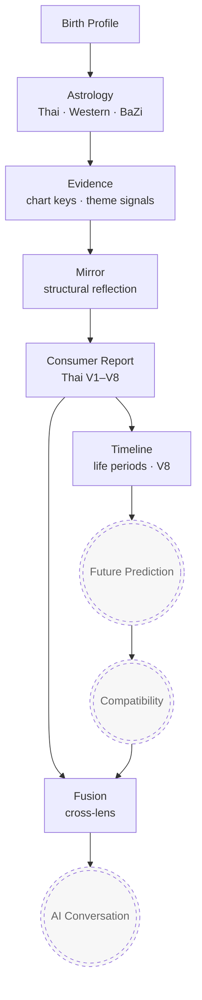
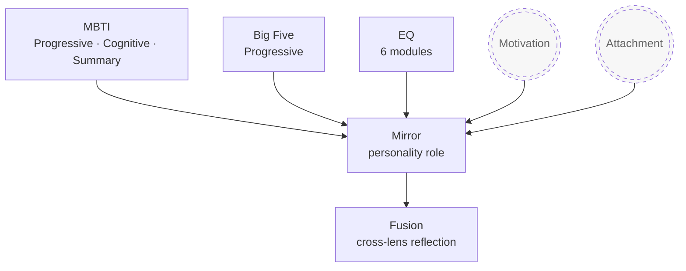
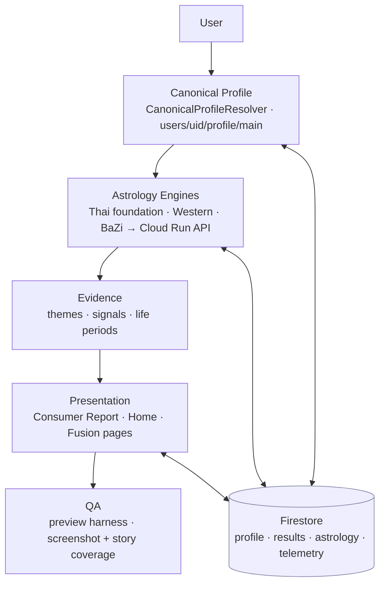
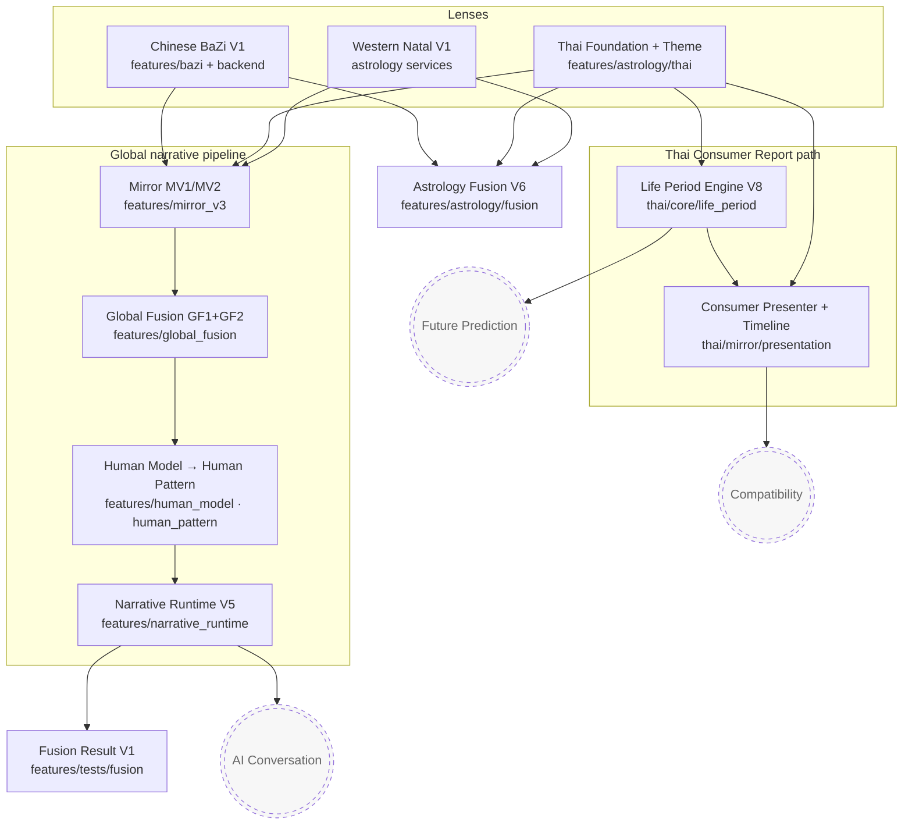

# DOMAIN MODEL

**Status:** CURRENT — the highest-level conceptual document in the repository.
**Audience:** Everyone (humans + AI agents).
**Last updated:** June 2026

This document describes *what KnowMe is conceptually* and how its pieces relate. For
the concrete code pipeline see [`ARCHITECTURE.md`](ARCHITECTURE.md); for the fastest
project overview see [`EXECUTIVE_SUMMARY.md`](EXECUTIVE_SUMMARY.md).

> **Legend for all diagrams.** Nodes are shipped unless marked.
> `((( )))` / **FUTURE** = planned, not yet implemented. Treat FUTURE nodes as roadmap
> concepts only — do not assume code exists (see `ROADMAP.md`, `GOVERNANCE.md` deferrals).

---

## 1. Human Understanding Model

The conceptual journey from a birth profile to integrated self-understanding. Astrology
is the emotional front door; later stages add depth. The last stages are future
direction.

**Shipped today:** Birth Profile → Astrology → Evidence → Mirror → Consumer Report →
Timeline, plus cross-lens Fusion (Fusion Result / Astrology Fusion).
**Future direction:** Future Prediction, Compatibility, and AI Conversation (the
deferred AI layer that sits *on top of* the deterministic core).

---

## 2. Personality Model

Structured personality lenses feed the same Mirror → Fusion pipeline as astrology.
Motivation and Attachment are future lenses.

**Shipped today:** MBTI (Progressive/Cognitive/Summary), Big Five, EQ → Personality
Mirror role → Fusion.
**Future direction:** Motivation and Attachment lenses.

---

## 3. Runtime Architecture

How a user request flows through the system at runtime. Firestore is the persistent
source of truth; the astrology engines call a Cloud Run API.

- **Canonical Profile** — single resolver with legacy-root migration (Decision D-003).
- **Astrology Engines** — deterministic Flutter engines + a Cloud Run FastAPI backend
  for chart/BaZi generation (Decision D-013).
- **QA** — renders the *real* pipeline/page; gates deploys (Decision D-010).
- **Firestore paths** — see [`FIRESTORE_SCHEMA.md`](FIRESTORE_SCHEMA.md).

---

## 4. Relationship between all engines (ownership + data flow)

Every engine's owning package and how data flows between them. The narrative pipeline
and the Thai consumer report are **two separate consumer paths** off the lens layer.

### Engine ownership table

| Engine / layer | Owner package | Consumes | Produces | State |
|----------------|---------------|----------|----------|-------|
| Western Natal | astrology services + `astrology/western_natal` | Birth profile | Natal chart | Frozen V1 |
| Thai Foundation + Theme | `lib/features/astrology/thai/foundation/`, `theme/` | Birth profile | Profile keys + theme signals | Frozen v0.1.0 (engine) |
| Chinese BaZi | `lib/features/bazi/` + backend | Birth profile | Four pillars + elements | Frozen V1 |
| Thai Life Period Engine + Timeline Intelligence | `lib/features/astrology/thai/core/life_period/` | Birth weekday/date + natal context (lagna lord) | Life-period + relationship/element/current/future intelligence evidence | Active V9 (evidence only) |
| Thai Prediction Intelligence Foundation | `lib/features/astrology/thai/core/prediction/` | V9 `LifeTimelineIntelligence` (timeline + natal + current/future intelligence) | Deterministic predictions per category × window (strength/confidence, evidence, opportunity/risk, reasons) | Active V10 (evidence only; no presenter) |
| Thai Decision Intelligence Foundation | `lib/features/astrology/thai/core/decision/` | V10 `PredictionIntelligence` (predictions per category × window) | Deterministic per-scenario recommendation (verdict, confidence, reasons, supporting/conflicting evidence, best/worst timing, tradeoffs, outcome) | Active V11 (evidence only; no presenter) |
| Thai Question Reasoning Foundation | `lib/features/astrology/thai/core/question/` | Structured `QuestionIntent` (kind + topic + constraint) + V11 `DecisionIntelligence` | Deterministic `QuestionResult` (resolved scenario, relevant windows/evidence, priority reasons, structured answer, confidence) | Active V12 (evidence only; no LLM, no parser, no presenter) |
| Thai Unified Reasoning Runtime | `lib/features/astrology/thai/core/runtime/` | `ReasoningRequest` (birth date + lagna? + asOf? + optional `QuestionIntent` + optional `DecisionScenario` focus) | Deterministic `ReasoningResponse` (Timeline/Prediction/Decision/Question snapshots + flattened `ReasoningEvidence` + `ReasoningTrace` + confidence) via `evaluate`/`predict`/`decide`/`question`/`answer` | Active V13 (orchestration only; the only public reasoning entry point; no presenter, no UI, no LLM) |
| Thai Scenario Simulation Foundation | `lib/features/astrology/thai/core/simulation/` | Birth date + `SimulationScenario` (+ lagna?/asOf?) driving the V13 `ThaiReasoningRuntime` | Deterministic `SimulationResult` (four option outcomes — Act now/Best window/Alternative window/Do nothing — each with expected/opportunity/risk/tradeoffs/timing/confidence/evidence + ranked `SimulationComparison`) | Active V14 (consumes the runtime only; evidence only; no AI, no presenter, no parser, no UI) |
| Thai Transit Intelligence Integration | `lib/features/astrology/thai/core/transit/` | A runtime `ReasoningResponse` → `TransitContext` (natal ruler + current planet + asOf); day-of-week ruler computed from asOf | Deterministic `TransitAssessment` (events/influences/impact/evidence/window) merged via `EnhancedReasoningRuntime` into an `EnhancedReasoningResponse` (untouched base + transit evidence pool) | Active V15 (enhancement layer; transit contributes evidence only — never decides/predicts/answers; runtime untouched; no AI, no presenter, no UI) |
| Thai Consumer presentation | `lib/features/astrology/thai/mirror/presentation/` | Mirror result + life periods | Consumer report copy + timeline | Active V3–V8 |
| Astrology Fusion V6 | `lib/features/astrology/fusion/` | Thai/Western/BaZi | Multi-system astrology reflection | Freeze candidate |
| Mirror MV1/MV2 | `lib/features/mirror_v3/` | Lens signals | `KnowMeMirrorSnapshot` | Frozen / additive |
| Global Fusion GF1/GF2 | `lib/features/global_fusion/` | Mirror snapshots | Composed fusion snapshot | GF1 frozen · GF2 implemented |
| Human Model / Pattern | `lib/features/human_model/`, `human_pattern/` | Fusion snapshot | Dimensions → activations | Completed (Recovery V2) |
| Narrative Runtime | `lib/features/narrative_runtime/` | Pattern activations | `NarrativeResult` | Frozen V5 |
| Fusion Result V1 | `lib/features/tests/fusion/` | Cross-lens | Fusion result page | Frozen v1 |
| Future Prediction / Compatibility / AI Conversation | — | — | — | **FUTURE** (not implemented) |

---

## 5. Key conceptual rules

- **Two consumer paths off the lenses:** the **Thai Consumer Report** (its own
  pipeline) and the **global narrative pipeline** (Mirror → GF → Human Model/Pattern →
  Narrative). They do not merge today.
- **Copy boundary:** engines emit structure + evidence; presenters/composers emit prose.
- **Determinism:** every shipped engine is reproducible and testable; AI is a FUTURE
  layer on top, never a core dependency.
- **Firestore is the runtime source of truth** for user data.
- New modules must be added to this document (see `AI_ALIGNMENT_CONTEXT.md` §16).

---

## Related documents

- [`ARCHITECTURE.md`](ARCHITECTURE.md) — concrete pipeline layers + runtime paths.
- [`EXECUTIVE_SUMMARY.md`](EXECUTIVE_SUMMARY.md) — whole-project summary + freeze map.
- [`DECISION_LOG.md`](DECISION_LOG.md) — *why* these relationships exist.
- [`PROJECT_FREEZE.md`](PROJECT_FREEZE.md) — per-engine freeze state.
- [`KNOWME_MASTER_CONTEXT.md`](KNOWME_MASTER_CONTEXT.md) — product vision + subsystem map.
- [`PROJECT_INDEX.md`](PROJECT_INDEX.md) — full documentation map.
