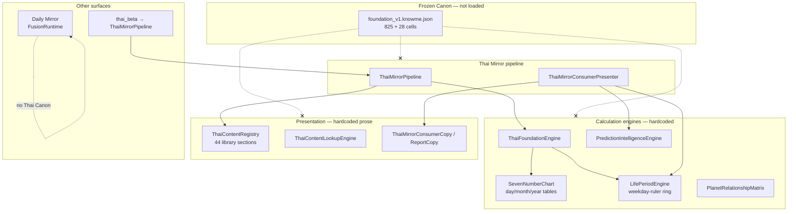

# Thai Astrology Canon Integration Audit

> **Scope:** Audit only — no runtime, engine, Rule Engine, Mirror, UI, or Canon changes.
>
> **Frozen Canon:** [`knowledge/canon/production/foundation_v1.knowme.json`](../knowledge/canon/production/foundation_v1.knowme.json)
> · Freeze commit `2a44ac4059468c131eb686d763a60b9d61f7c4b6`
>
> **Audit date:** 2026-07-04 · **Method:** Full-repo trace of Canon load paths, Thai
> engine/presentation wiring, hardcoded knowledge overlap, and validation status.

Status: **AUDIT COMPLETE**

---

## Executive summary

The frozen Mahabhut Canon (**825 atomic units + 28 reference-table cells**) is
**validated and complete** but **not connected to Thai astrology runtime,
Mirror, or user-facing output**. No Dart code loads `foundation_v1.knowme.json`,
`producedUnits`, or `producedReferenceTableCells`.

The live product runs on a **parallel legacy stack**:

- **Calculation engines** with hardcoded rotation tables and life-period metadata
- **`ThaiContentRegistry`** (~44 Dart content sections) for Mirror prose
- **`PlanetRelationshipMatrix`** for timeline/prediction scoring
- **Fusion Runtime** for Daily Mirror (cross-system; no Canon)

Canon platform code (ontology, workspace, validation, ingestion) is **self-contained**.
Completing Phase I freeze did **not** change product behaviour.

**Recommended next phase:** **Canon Evidence Mapping Layer** (see §7).

---

## 1 · Canon usage map

### 1.1 What consumes frozen Canon today

| Consumer | Path | Role | Canon domain |
|---|---|---|---|
| **Validation gate** | `test/validation/thai/thai_canon_production_sprint2_test.dart` | Validates 825 units + 28 reference cells via generated fixtures mirroring production | All Mahabhut domains |
| **Generated fixtures** | `test/validation/thai/generated/phase_*.dart` | Parallel Dart copies of production batches (not loaded from JSON at test time) | C–G batches |
| **Python merge tooling** | `tool/merge_phase_*.py`, `tool/merge_batch*_foundation.py` | Offline merge into `foundation_v1.knowme.json` | Production tooling |
| **Documentation** | `docs/THAI_MAHABHUT_CANON_*`, `DECISION_LOG.md` | Freeze/audit records | — |

**Runtime / Mirror / thai_beta:** **zero consumption** of frozen Canon.

### 1.2 Canon platform (isolated — not frozen Mahabhut production)

| Component | Path | Loads at runtime? | Notes |
|---|---|---|---|
| `CanonKnowledgeEngine` | `lib/.../canon/canon_knowledge_engine.dart` | **No** (`loadFromAssets` never called from `lib/`) | Targets empty `canon.knowme.json` |
| `CanonDatabase` | `lib/.../canon/database/canon_database.dart` | **No** | Targets empty `canon_database.knowme.json` |
| `KnowledgeProductionReport` | `lib/.../canon/production/canon_knowledge_production.dart` | **No** | Metrics over atomic units; validation only |
| `AtomicKnowledgeGraph` | `lib/.../canon/atomic/atomic_knowledge_graph.dart` | **No** (runtime) | Workspace, golden, validation |
| `CanonOntologyData` | `lib/.../canon/ontology/canon_ontology_data.dart` | **No** (runtime) | Shared vocabulary IDs; not wired to engines |
| Canon Review Workspace | `lib/features/knowledge_workspace/canon_review/` | Internal UI only | Ingestion review; not product |
| Reference-table model | `lib/.../canon/reference/canon_reference_table_*.dart` | **No** (runtime) | Validation + platform model |

`pubspec.yaml` bundles `knowledge/canon/` (including `production/foundation_v1.knowme.json`)
but **no Dart loader** reads the production file.

### 1.3 Thai runtime knowledge flow (what the product actually uses)

### 1.4 Knowledge loading / mapping / transform paths

| Layer | Entry point | Knowledge source | Transforms to |
|---|---|---|---|
| **Foundation** | `ThaiFoundationEngine.generate` | Hardcoded engines + lunar tables | `ThaiAstrologyProfile` (signals, keys) |
| **Interpretation** | `ThaiMeaningRouter.route` | Hardcoded rules (`interpretation/rules/`) | `ThaiInterpretationFact` (structural predicates) |
| **Content lookup** | `ThaiContentLookupEngine.lookup` | `ThaiFactToContentKeyMapper` → `ThaiContentRegistry` | Content fragments (hardcoded prose) |
| **Mirror assembly** | `ThaiMirrorAssembler.assemble` | Profile signals + `ThaiContentRegistry` | `ThaiMirrorResult` (themes, sections) |
| **Life timeline** | `LifePeriodEngine.fromBirthData` | `life_planet.dart` strengths + `PlanetRelationshipMatrix` | `LifeTimeline` evidence |
| **Prediction** | `PredictionIntelligenceEngine` | Scoring over life-period evidence | Category × window predictions |
| **Consumer report** | `ThaiMirrorConsumerPresenter.present` | Copy composers + timeline + prediction composers | `ThaiMirrorConsumerViewState` |
| **Daily Mirror** | `MirrorExperienceService.daily` | `FusionRuntime.fuse` + `MirrorCopy` | Opportunity/caution/focus (not Thai-specific) |
| **Research beta** | `ThaiBetaAnalysisRunner.run` | Same as Thai Mirror pipeline | Consumer view state + JSON snapshot |
| **Knowledge Workspace** | `knowledge_workspace_data.dart` | `evidence.knowme.json`, `research.knowme.json`, `planet_relationships.knowme.json` | Internal review UI only |

**None** of these paths import `lib/features/astrology/thai/knowledge/canon/` production data.

### 1.5 Legacy matrices and static maps still in use

| File | Knowledge held | Canon equivalent |
|---|---|---|
| `foundation/chart/seven_number_chart.dart` | Day-base rotation matrix (7 weekdays) | Phase G lookup / remainder tables |
| `foundation/calendar/thai_month_base_table.dart` | Month row bases | p19–p20 chart construction |
| `foundation/calendar/thai_zodiac_year.dart` | Year row bases | p19–p20 chart construction |
| `foundation/constants/thai_lagna_rulership.dart` | Lagna → lord map | Not in Mahabhut Canon scope |
| `core/life_period/life_planet.dart` | Dasha year strengths, phase names, domain affinities | Phase D `agePeriod` + life-period placements |
| `core/life_period/planet_relationship_matrix.dart` | Friend/neutral/enemy bonds | Separate from Canon atomic graph |
| `core/life_period/planet_element.dart` | Planet → element mapping | Planet library attributes in Canon |
| `content/library/**/*.dart` (44 files) | Mahabhut positions, lagna, Myanmar seven, ramahabhuta prose | Foundation + archetype + planet library Canon units |
| `mirror/presentation/copy/*.dart` | Consumer/report narrative templates | No Canon equivalent (generated copy layer) |
| `mirror/presentation/prediction/prediction_reason_copy.dart` | Prediction reason prose | Phase E prediction rules (different model) |

### 1.6 Surfaces that do not use Canon at all

| Surface | Why |
|---|---|
| **Thai Foundation Engine** | Structural calculation only; no knowledge corpus |
| **Thai Mirror Result / Consumer Report** | `ThaiContentRegistry` + copy composers |
| **Daily Mirror (Home V4)** | Fusion Runtime over evaluate/predict/decide — no Thai Canon |
| **thai_beta research** | Wrapper around `ThaiMirrorPipeline` |
| **Global Reasoning Runtime V17 / Fusion P2** | Thai adapter uses frozen V9–V16 engines, not Canon |
| **Rule Engine (`ThaiMeaningRouter`)** | Emits structural facts; meanings from content library |
| **Knowledge Workspace** | Separate evidence/research JSON; explicitly not engine-fed |

---

## 2 · Engine coverage by Canon domain

| Canon domain | Frozen records | Engine / runtime status | Detail |
|---|---|---|---|
| **Mahabhut positions** | 7 ontology entities + placement/signification units | **Partially used** | `MahabhutaEngine` emits all 7 `ThaiContentKeys.mahabhuta_*` keys unconditionally (กาลโยค activation TODO). Meanings from hardcoded `content/library/mahabhuta/`, not Canon atomic units. |
| **Archetype natal placements** | 40+ units across 7 charts | **Not connected** | No engine derives archetype chart from birth data. Canon stores chart-scoped `located_in` facts; runtime has no archetype resolver. |
| **Planet attributes** | 301 units (`relates_to → attribute.*`) | **Not connected** | Planet library attributes exist only in Canon. Runtime uses theme/content library, not attribute triples. |
| **Taksa role assignments** | 95 units (Phase C) | **Not connected** | No Taksa engine. `taksaRole.*` ontology unused at runtime. |
| **Life Period placements** | 226 units (Phase D) | **Partially used** | `LifePeriodEngine` builds weekday-ruler timeline from `life_planet.dart` + relationship matrix. Does **not** read per-archetype Mahabhut placements from Canon. |
| **Prediction Rules** | 5 units (Phase E) | **Partially used** | `PredictionIntelligenceEngine` scores categories/windows from life-period evidence. Canon `predictionEffect` / rise-fall rules not loaded. Copy from `prediction_reason_copy.dart`. |
| **Remedies** | 87 units (Phase F) | **Stored but unused** | Zero runtime/Mirror references to `remedy.*`, `remedyItem.*`, or ritual targets. **Not safe for user output** without safety layer. |
| **Lookup Tables** | 55 atomic units (Phase G) | **Not connected** | Chart construction uses hardcoded `SevenNumberChart` + month/year tables, not Canon lookup rows. |
| **Reference-table cells** | 28 cells (D-078) | **Stored but unused** | `CanonReferenceTableCell` validated in tests only. No birth-date → chart resolver in runtime. |

### Safety classification for user-facing output

| Domain | User-facing today? | Safe as-is? |
|---|---|---|
| Foundation significations | Indirectly via content library themes | Partial — prose is reflective, not Canon-verbatim |
| Mahabhut placements | Yes (position-themed Mirror sections) | Partial — keys emitted without กาลโยค; prose is generic |
| Taksa | No | N/A |
| Life Period | Yes (timeline section) | Yes — uses deterministic engine evidence, not Canon placements |
| Prediction Rules | Yes (future prediction section) | Yes — engine-scored; not Canon rule text |
| Remedies | **No** | **No — must remain internal** |
| Lookup Tables | No (calculation only) | Internal calculation; Canon tables not used |

---

## 3 · Presentation coverage

### 3.1 Thai Consumer Report / Thai Mirror Result

**Pipeline:** `ThaiMirrorPipeline` → `ThaiMirrorConsumerPresenter` → consumer preview / result pages.

| Canon domain | Reflected in user output? | Source actually shown |
|---|---|---|
| **Foundation significations** | Partial | Theme-weighted copy from `thai_mirror_evidence_composer.dart` / `thai_mirror_consumer_copy.dart` — not Canon triples |
| **Mahabhut placements** | Partial | Generic position prose from `content/library/mahabhuta/*.dart` keyed by `ThaiContentKeys.mahabhuta_*` |
| **Archetype natal placements** | **No** | No archetype chart in profile or report |
| **Taksa** | **No** | No Taksa section or copy |
| **Life Period** | Yes | `thai_mirror_life_timeline_section.dart` via `LifePeriodEngine` + `timeline_presenter.dart` + relationship matrix scoring |
| **Prediction Rules** | Partial | `thai_mirror_future_prediction_section.dart` via `PredictionIntelligenceEngine` + `prediction_composer.dart` — engine categories, not Canon rise/fall rules |
| **Remedies** | **No** | No remedy sections; **correct per D-077 freeze policy** |
| **Lookup Tables** | **No** | Chart numbers may appear in profile metadata; lookup semantics not surfaced |

**Evidence transparency:** `thai_mirror_source_transparency_section.dart` and narrative report sections cite engine themes and structural evidence — **not** Canon page provenance from `foundation_v1`.

### 3.2 Daily Mirror (Home V4)

| Aspect | Finding |
|---|---|
| Entry | `DailyMirrorSection` → `MirrorExperienceService.daily` |
| Runtime | **Fusion Runtime** (`ReasoningCapability.evaluate/predict/decide`) |
| Thai Canon | **Not used** |
| Copy | `mirror_copy.dart` — generic life-area guidance |

Daily Mirror is **cross-system fusion**, not Thai Mahabhut Canon output.

### 3.3 Research Beta (`thai_beta`)

| Aspect | Finding |
|---|---|
| Flow | `ThaiBetaInput` → `BirthNormalizer` → `ThaiMirrorPipeline` → consumer view state |
| Snapshot | `ThaiBetaReportSnapshot` captures profile keys (`mahabhutaPositionKeys`, themes) — not Canon unit ids |
| Canon | **Not used** |
| Purpose | Research feedback wrapper over existing Thai report |

### 3.4 Remedies — explicit policy check

- **87 remedy units** frozen in Canon (procedure, directions, buddha-day images, embedded life-period remedy pages).
- **Zero** Mirror/presentation references to remedy ontology or copy.
- Canon freeze and D-077 explicitly state remedies are **structure only, not user-facing advice**.
- **No separate safety/presentation layer exists** — absence of remedy UI is the current safety posture.

---

## 4 · Hardcoded knowledge overlap map

Knowledge duplicated in concept between frozen Canon and legacy runtime content.
**No bridge code** connects them.

| File path | Hardcoded knowledge | Canon equivalent? | Recommendation |
|---|---|---|---|
| `content/library/mahabhuta/mahabhuta_thongchai.dart` (+ 6 siblings) | Reflective prose for 7 Mahabhut positions | Yes — `mahabhutPosition.*` + signification units | **Map to Canon later** via evidence layer; keep hardcoded until mapping proves parity |
| `content/library/mahabhuta/mahabhuta_content.dart` | Registry of all position sections | Yes | Deprecate prose source after Canon-backed evidence + approved copy policy |
| `content/library/lagna/lagna_*.dart` (12 files) | Lagna sign prose | Partial — lagna not primary Mahabhut scope | **Remain hardcoded** — different product layer (Vedic-style lagna vs Mahabhut book) |
| `content/library/lagna_lords/lagna_lord_*.dart` (7 files) | Lagna lord prose | Partial — planet library overlaps | **Remain hardcoded** short term; optional Canon cross-ref later |
| `content/library/myanmar/myanmar_seven_*.dart` (7 files) | Myanmar seven position prose | Partial — chart/signification overlap | **Map to Canon later** if Myanmar keys align to extracted facts |
| `content/library/ramahabhuta/ramahabhuta_*.dart` (4 files) | Element prose | Partial — planet→element in Canon planet library | **Remain hardcoded** unless element facts promoted to evidence |
| `foundation/chart/seven_number_chart.dart` | `_dayBaseRotations` 7×7 matrix | Yes — Phase G lookup / rotation units | **Map to Canon later** for table provenance; keep calculation frozen until mapping layer validates parity |
| `foundation/calendar/thai_month_base_table.dart` | Month base rows | Yes — p19–p20 Canon units | Same as above |
| `foundation/calendar/thai_zodiac_year.dart` | Year base rows | Yes — p19–p20 Canon units | Same as above |
| `core/life_period/life_planet.dart` | Dasha year counts (Sun 6, Moon 15, …) | Yes — p18 `agePeriod` units (4 planets in Canon; engine has 8 `LifePlanet`) | **Remain hardcoded** for engine determinism; Canon is provenance record, not yet authoritative for runtime |
| `core/life_period/planet_relationship_matrix.dart` | Natural friendship table | No direct Canon equivalent | **Remain hardcoded** — separate research layer (`planet_relationships.knowme.json` mirrors this matrix) |
| `core/life_period/planet_element.dart` | Planet elements | Yes — attribute units in Canon | **Map to Canon later** via ontology |
| `mirror/presentation/timeline/period_narrative_composer.dart` | Period narrative option lists | Partial — life-period Canon placements | **Needs presentation layer** before Canon facts surface |
| `mirror/presentation/prediction/prediction_reason_copy.dart` | Reason-code → Thai prose | Partial — Phase E prediction rules | **Remain hardcoded** until Canon evidence mapping defines safe reason alignment |
| `knowledge/planet_relationships/planet_relationships.knowme.json` | Research records seeded from matrix | No — explicitly not from Mahabhut Canon | **Remain separate** research track |

### ID namespace mismatch (blocks direct wiring)

| Runtime key | Canon ontology id |
|---|---|
| `ThaiContentKeys.mahabhutaThongchai` = `'mahabhuta_thongchai'` | `mahabhutPosition.thongchai` |
| `LifePlanet.jupiter` (enum) | `planet.jupiter` (atomic subject) |
| `ThaiSignalFactType.mahabhutaPosition` | `located_in` + `context.archetype_chart` units |

Same concepts, **different identifier systems** — integration requires an explicit mapping layer.

---

## 5 · Integration readiness

| Canon domain | Readiness | Rationale |
|---|---|---|
| Foundation significations | **NEEDS_MAPPING_LAYER** | Canon has atomic `owns`/`relates_to` facts; runtime uses theme-weighted reflective prose |
| Mahabhut positions | **NEEDS_MAPPING_LAYER** | Keys exist in engine + content library; Canon adds provenance, chart-scoped placements, signification triples |
| Archetype natal placements | **NEEDS_MAPPING_LAYER** | Requires birth → archetype chart resolver not present in runtime |
| Planet attributes | **INTERNAL_ONLY** | Rich Canon data; no user-facing attribute surface today |
| Taksa | **NOT_CONNECTED** | No runtime Taksa model or presentation slot |
| Life Period (Canon placements) | **NEEDS_MAPPING_LAYER** + **NEEDS_PRESENTATION_LAYER** | Engine timeline exists but uses different evidence model than 226 Canon units |
| Prediction Rules | **NEEDS_MAPPING_LAYER** | Engine predictions work; Canon rules are separate declarative facts |
| Remedies | **NOT_SAFE_FOR_USER_OUTPUT** | Frozen as structure only; no safety/presentation policy layer |
| Lookup Tables (atomic) | **NEEDS_MAPPING_LAYER** | Hardcoded tables power calculation; Canon holds authoritative table facts |
| Reference-table cells | **NEEDS_MAPPING_LAYER** | Model exists; no resolver from birth date → cell |
| Canon ontology (`CanonOntologyData`) | **READY_TO_INTEGRATE** (as vocabulary) | Validated, aligned to production; needs loader + query API only |
| `AtomicKnowledgeGraph` | **READY_TO_INTEGRATE** (as infrastructure) | Can index loaded units; not wired to runtime |

---

## 6 · Risk audit

Risks if Canon were integrated into runtime **without** the mapping and safety layers
recommended below:

| Risk | Severity | Description |
|---|---|---|
| **Incorrect user-facing interpretation** | **High** | Canon stores verbatim source facts (including D-071 Jupiter tension at two positions). Surfacing raw triples or auto-generated prose could contradict engine themes or mislead users. |
| **Overusing remedy knowledge** | **Critical** | 87 remedy units describe ritual procedure, directions, and symbolic acts. Exposing these as Mirror "advice" violates D-077 and creates product/legal safety risk. |
| **Exposing ritual/procedure as advice** | **Critical** | Remedy `requires` / `relates_to` chains are Canon structure, not vetted consumer copy. |
| **Mixing structural evidence with prediction copy** | **High** | `PredictionIntelligenceEngine` output is carefully scored; injecting Canon `predictionEffect` text could bypass confidence/window logic. |
| **Breaking deterministic outputs** | **High** | `ThaiBetaReportSnapshot` hashes depend on stable engine output. Swapping knowledge sources without golden regression would break research comparability. |
| **Replacing frozen engine behaviour too aggressively** | **High** | `SevenNumberChart`, `LifePeriodEngine`, and `PlanetRelationshipMatrix` are frozen engine layers (D-019–D-026). Canon should attach as **evidence/provenance**, not replace calculation. |
| **Lookup table parity failure** | **Medium** | 114 OCR-blocked + 28 extracted reference cells ≠ full book tables. Runtime hardcoded tables may differ from partial Canon extraction. |
| **Archetype mis-resolution** | **Medium** | Canon life-period facts require correct archetype chart context; no runtime resolver exists. |
| **Silent dual sources of truth** | **Medium** | Hardcoded content library and Canon could diverge if both feed presentation without explicit precedence rules. |

---

## 7 · Recommended next implementation phase

**Canon Evidence Mapping Layer**

### Why this phase (and not the alternatives)

| Alternative | Why not first |
|---|---|
| Thai Report Canon Evidence Upgrade | Report cannot cite Canon until units are loadable, queryable, and mapped to engine signals |
| Thai Engine Canon Integration | Too aggressive — risks replacing frozen calculation behaviour before mapping proves parity |
| Remedy Safety / Presentation Policy | Premature — remedies are correctly absent from UI; policy matters only after mapping exists |
| No integration yet | Canon freeze explicitly completed to enable integration; mapping is the minimal safe first step |

### Scope of recommended phase

1. **Loader** — read-only access to frozen `foundation_v1.knowme.json` + reference cells (asset or file loader; no Canon edits).
2. **Index** — build `AtomicKnowledgeGraph` + reference-table index over production units.
3. **Mapping API** — deterministic queries: by subject/relation/object, `context`, evidence page; map `mahabhutPosition.*` ↔ `ThaiContentKeys.mahabhuta_*`; map planets/enums ↔ `planet.*`.
4. **Evidence records** — emit structured `CanonEvidenceRef` (unit id, page, relation) attachable to engine signals **without** changing engine output or Mirror copy.
5. **Explicit exclusions** — remedies queryable internally but **blocked** from any user-facing adapter until a separate Remedy Safety policy phase.
6. **Validation** — extend Thai validation suite with mapping-layer tests; golden parity checks against hardcoded tables where overlap exists.

**Non-goals for this phase:** Mirror copy changes, engine calculation changes, remedy UI, prediction prose replacement.

---

## 8 · Validation record

No dedicated integration-audit script exists. Relevant existing validation was re-run:

| Gate | Command | Result |
|---|---|---|
| Thai validation suite | `flutter test test/validation/thai/` | **287 / 287 pass** |
| Canon production gate | Included in suite (`thai_canon_production_sprint2_test.dart`) | **Pass** |
| Reference-table rules | Included in suite (`phase_g_reference_table_cells.dart`) | **Pass** |

Integration audit itself required **no code changes** beyond this document.

---

## 9 · Related documents

| Document | Role |
|---|---|
| [`THAI_MAHABHUT_CANON_FREEZE.md`](THAI_MAHABHUT_CANON_FREEZE.md) | Phase I freeze record |
| [`THAI_MAHABHUT_CANON_FINAL_AUDIT.md`](THAI_MAHABHUT_CANON_FINAL_AUDIT.md) | Phase H pre-freeze audit |
| [`THAI_CANON_PLATFORM_PRODUCTION_MODE_V1.md`](THAI_CANON_PLATFORM_PRODUCTION_MODE_V1.md) | Production Mode governance (D-065/D-066) |
| [`THAI_MAHABHUT_CANON_PLATFORM_FREEZE_V1.md`](THAI_MAHABHUT_CANON_PLATFORM_FREEZE_V1.md) | Canon platform freeze |
