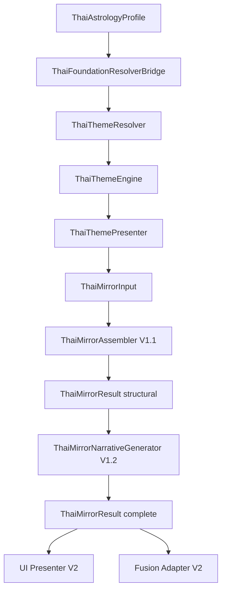

# Thai Mirror Specification V1

**Status:** Specification complete — domain models only, no UI / assembler / narrative impl  
**Date:** 2026-06-08  
**Contract version:** `v1`

---

## Executive Summary

Thai Mirror transforms a deterministic **Thai Astrology Profile** into **Self-Understanding Output** — reflective, evidence-backed themes organized into nine reader-facing sections. V1 delivers the **domain layer** and **output contract** only. No widgets, screens, Home integration, or Fusion wiring.

---

## 1. Thai Mirror Architecture

### Pipeline (existing → new)

```
ThaiAstrologyProfile
        ↓
ThaiFoundationResolverBridge        (existing — read-only)
        ↓
ThaiThemeResolver                   (existing — DO NOT MODIFY)
        ↓
ThaiThemeEngine                     (existing — DO NOT MODIFY)
        ↓
ThaiThemePresenter                  (existing — DO NOT MODIFY)
        ↓
ThaiMirrorInput                     (NEW)
        ↓
ThaiMirrorAssembler                 (V1.1 — spec only in V1)
        ↓
ThaiMirrorResult                    (NEW — output contract)
        ↓
ThaiMirrorNarrativeGenerator        (V1.2+ — spec only in V1)
```

### Layer boundaries

| Layer | Responsibility | V1 status |
|-------|----------------|-----------|
| Foundation | Birth data → profile keys | Done |
| Theme Resolver/Engine/Presenter | Content → scored themes + evidence | Done |
| **Mirror Assembler** | Themes → sections + evidence graph | Spec only |
| **Mirror Narrative** | Sections → readable summaries | Spec only |
| **Mirror Presenter (UI)** | Result → widgets | Out of scope |
| Fusion Adapter | Mirror → FusionSignal | Future |

### Design principles

1. **Reflective, not predictive** — self-understanding language only  
2. **Evidence-first** — every theme traces to Lagna / Lagna Lord / Myanmar / Mahabhuta  
3. **Deterministic** — same profile → same structural result  
4. **KnowMe positioning** — mirror, not fortune-teller  
5. **Additive** — no changes to existing Theme or Foundation layers

---

## 2. Mirror Models

| Model | Path | Purpose |
|-------|------|---------|
| `ThaiMirrorSectionId` | `mirror/models/thai_mirror_section_id.dart` | 9 section ids |
| `ThaiMirrorLensSource` | `mirror/models/thai_mirror_lens_source.dart` | 4 traceable lenses |
| `ThaiMirrorEvidence` | `mirror/models/thai_mirror_evidence.dart` | Content-key evidence row |
| `ThaiMirrorThemeRef` | `mirror/models/thai_mirror_theme_ref.dart` | Theme in section |
| `ThaiMirrorSection` | `mirror/models/thai_mirror_section.dart` | Section contract |
| `ThaiMirrorProfileContext` | `mirror/models/thai_mirror_profile_context.dart` | Audit / warnings |
| `ThaiMirrorInput` | `mirror/models/thai_mirror_input.dart` | Assembler input |
| `ThaiMirrorResult` | `mirror/models/thai_mirror_result.dart` | Top-level output |
| `ThaiMirrorContract` | `mirror/spec/thai_mirror_contract.dart` | Version + disclaimers |
| `ThaiMirrorAssemblerSpec` | `mirror/spec/thai_mirror_assembler_spec.dart` | Assembly rules |
| `ThaiMirrorNarrativeGeneratorSpec` | `mirror/spec/thai_mirror_narrative_generator_spec.dart` | Narrative constraints |

---

## 3. Mirror Result Contract (`ThaiMirrorResult`)

```dart
ThaiMirrorResult {
  contractVersion: 'v1'
  generatedAt: DateTime?
  profileContext: ThaiMirrorProfileContext
  topThemes: List<ThaiMirrorThemeRef>      // max 5 default
  sections: List<ThaiMirrorSection>        // 8 fusion sections
  disclaimers: List<String>
  narrativeStatus: structuralOnly | partial | complete
}
```

### Narrative status lifecycle

| Status | Meaning |
|--------|---------|
| `structuralOnly` | V1 default — themes + evidence, summaries null |
| `partial` | Some sections have summaries |
| `complete` | All narrative sections filled |

---

## 4. Section Definitions

### `ThaiMirrorSection` contract

```dart
ThaiMirrorSection {
  id: ThaiMirrorSectionId
  title: String          // English
  titleTh: String        // Thai
  summary: String?       // null until narrative generator
  supportingThemes: List<ThaiMirrorThemeRef>
  evidence: List<ThaiMirrorEvidence>
}
```

### Section catalog

| ID | Title (EN) | Title (TH) | Theme source |
|----|------------|------------|--------------|
| `top_themes` | Top Themes | ธีมเด่น | Global top-N by score |
| `core_self` | Core Self | แก่นตัวตน | `ThemeCategory.coreSelf` |
| `thinking_style` | Thinking Style | รูปแบบการคิด | `ThemeCategory.thinkingStyle` |
| `emotional_world` | Emotional World | โลกอารมณ์ | `ThemeCategory.emotionalWorld` |
| `relationships` | Relationships | ความสัมพันธ์ | `ThemeCategory.relationships` |
| `work_and_ambition` | Work & Ambition | งานและความทะเยอทะยาน | `ThemeCategory.workAndAmbition` |
| `strengths` | Strengths | จุดแข็ง | `ThemeCategory.strengths` |
| `growth_areas` | Growth Areas | พื้นที่เติบโต | `ThemeCategory.growthAreas` |
| `growth_path` | Growth Path | เส้นทางเติบโต | `ThemeCategory.growthPath` |

### Top Themes examples

From `ThemeCatalogV1`: `disciplined`, `builder`, `leadership`, `analytical`, `empathetic`, etc.

Top Themes is a **cross-cutting ranked view** — not a Fusion category. Fusion sections exclude `top_themes`.

### Assembly rules (V1.1 implementation)

1. Sort all `ThaiPresentedTheme` by `score` descending  
2. `topThemes` ← first `topThemeLimit` (default 5)  
3. For each fusion section: filter themes where `ThemeRegistry.getById(themeId).category` matches  
4. Within section: sort by score desc  
5. `evidence` ← union of `ThaiThemeEvidence` from supporting themes, mapped to `ThaiMirrorEvidence`

---

## 5. Evidence Design

### Lens sources (required traceability)

| `ThaiMirrorLensSource` | Profile field | Content type |
|------------------------|---------------|--------------|
| `lagna` | `lagnaKey` | `ThaiContentType.lagna` |
| `lagnaLord` | `lagnaLordKey` | `ThaiContentType.lagnaLord` |
| `myanmarSeven` | `myanmarKeys[]` | `ThaiContentType.myanmarSeven` |
| `mahabhutaPosition` | `mahabhutaPositionKeys[]` | `ThaiContentType.mahabhutaPosition` |

**Excluded:** `ramahabhuta` (per Foundation V1.1 profile contract).

### `ThaiMirrorEvidence` contract

```dart
ThaiMirrorEvidence {
  lensSource: ThaiMirrorLensSource
  contentKey: String              // e.g. 'thai.lagna.aries'
  contentTitle: String?           // from ThaiContentSection.title
  contribution: double            // from ThaiThemeEvidence.contribution
  supportedThemeIds: List<String> // themes this row backs in section
}
```

### Evidence invariants

- Every `ThaiMirrorThemeRef` in a section must have ≥1 evidence row  
- Every evidence row must resolve via `ThaiContentRegistry.resolve(contentKey)`  
- No evidence without a published content section  
- No AI-invented keys or lens sources  
- Duplicate `contentKey` in one section → merge contributions, union theme ids

### Example evidence chain

```
GC-05 profile
  → lagnaKey: thai.lagna.taurus
  → ThaiContentSection.themeMappings → theme: 'grounded'
  → ThaiThemeEvidence(contentKey, lagna, contribution)
  → ThaiMirrorEvidence(lensSource: lagna, contentKey, supportedThemeIds: ['grounded'])
```

---

## 6. Narrative Generator Spec

**Not implemented in V1.** Constraints defined in `ThaiMirrorNarrativeGeneratorSpec`.

### Input / output

| | Type |
|---|------|
| Input | `ThaiMirrorResult` with `narrativeStatus: structuralOnly` |
| Output | `ThaiMirrorResult` with section `summary` fields populated |

### Language rules

**Required hedging (≥1 per summary):**  
อาจ, หลายครั้ง, มีแนวโน้ม, มักจะ, may, tends to, might

**Banned (predictive):**  
จะรวย, จะแต่งงาน, ชะตา, destiny, guaranteed, soulmate, lottery, etc.

### Allowed content sources

- `ThaiContentSection.summary`, `coreNature`, `strengths`, `challenges`, `growthPath`
- `ThemeDefinition.description` from `ThemeRegistry`
- **Not allowed:** LLM free-generation without content anchors

### Constraints

1. Do not modify scores, theme ids, or evidence at narrative time  
2. Every summary must reference ≥1 `contentKey` in metadata  
3. Acknowledge `hasBirthTime: false` for lagna-dependent copy  
4. Top Themes section: names only — no paragraph narrative

---

## 7. Future Fusion Compatibility

### Alignment with Fusion V1

| Mirror | Fusion |
|--------|--------|
| `ThaiMirrorSectionId` (fusion sections) | `ThemeCategory` |
| `ThaiMirrorThemeRef.themeId` | `ThemeCatalogV1` ids |
| `ThaiMirrorEvidence` | Traceability for cross-lens merge |
| `profileContext.warnings` | Confidence degradation |

### Future adapter (V2 — not in scope)

```
ThaiMirrorResult
        ↓
ThaiMirrorFusionAdapter.toSignals()
        ↓
List<FusionSignal>   // source: FusionSignalSource.astrology (new Thai subtype)
```

### Mapping strategy (documented, not implemented)

1. Export top 3–5 theme ids per fusion section as signal candidates  
2. Map theme confidence → `FusionSignalStrength` (low/medium/high)  
3. Store mirror contract version in Firestore snapshot for replay safety  
4. Fusion synthesis continues to use locked `FusionSignalIds` — Thai themes feed via explicit mapping table (separate spec)

### Firestore snapshot shape (future)

```json
{
  "mirror_contract_version": "v1",
  "calculation_standard": "v1.1",
  "top_themes": ["disciplined", "builder"],
  "sections": { "core_self": { "themes": [...], "evidence_keys": [...] } },
  "narrative_status": "structural_only"
}
```

---

## 8. Migration Impact

| Area | Impact |
|------|--------|
| Existing users | None — no runtime change |
| `ThaiAstrologyProfile` | None — consumed as-is |
| Theme layers | None — read-only upstream |
| Foundation Engine | None |
| Western / MBTI / EQ / BaZi | None |
| Fusion | None until adapter V2 |
| Home / navigation | None |

### Rollout plan

| Phase | Deliverable |
|-------|-------------|
| **V1 (this)** | Models + spec |
| V1.1 | `ThaiMirrorAssembler` + unit tests |
| V1.2 | `ThaiMirrorNarrativeGenerator` from content library |
| V2.0 | UI presenter + optional Fusion adapter |
| V2.1 | Firestore persistence + Home entry |

---

## 9. Blast Radius

| Component | Modified? | Risk |
|-----------|-----------|------|
| Theme Resolver / Engine / Presenter | No | None |
| Foundation Engine | No | None |
| Content Library | No | None |
| Fusion engine | No | None |
| `lib/.../mirror/*` | **New** | Isolated |
| Tests | None yet | None |

---

## 10. Files To Create

```
lib/features/astrology/thai/mirror/
  models/
    thai_mirror_section_id.dart
    thai_mirror_lens_source.dart
    thai_mirror_evidence.dart
    thai_mirror_theme_ref.dart
    thai_mirror_section.dart
    thai_mirror_profile_context.dart
    thai_mirror_input.dart
    thai_mirror_result.dart
  spec/
    thai_mirror_contract.dart
    thai_mirror_assembler_spec.dart
    thai_mirror_narrative_generator_spec.dart

docs/
  THAI_MIRROR_SPECIFICATION_V1.md
```

### Future files (V1.1+)

```
mirror/thai_mirror_assembler.dart
mirror/thai_mirror_narrative_generator.dart
mirror/integration/thai_mirror_fusion_adapter.dart
test/thai_mirror_assembler_test.dart
test/thai_mirror_contract_test.dart
```

---

## 11. Files To Avoid Modifying

| Path | Reason |
|------|--------|
| `lib/features/astrology/thai/theme/**` | Locked theme pipeline |
| `lib/features/astrology/thai/foundation/**` | Foundation V1.1 frozen |
| `lib/features/astrology/thai/content/**` | Content library complete |
| `lib/features/tests/fusion/**` | Fusion V1 locked |
| MBTI / EQ / Western / BaZi modules | Out of scope |
| `lib/main.dart`, Home, navigation | No UI in V1 |

---

## Definition of Done (V1)

- [x] Architecture documented with clear layer boundaries  
- [x] Mirror models implement output contract  
- [x] 9 sections defined with `ThaiMirrorSection` contract  
- [x] Evidence design with 4-lens traceability  
- [x] Narrative generator spec (input/output/constraints) — no impl  
- [x] Fusion compatibility documented  
- [x] Migration impact + blast radius documented  
- [x] No modifications to forbidden systems  
- [x] `flutter analyze` clean on new mirror module  

---

## 12. V1 Truth Lock Policy (Engine Truth Only)

**Status:** Frozen — V1 Freeze candidate  
**Date:** 2026-06-08  
**Product decision:** Truth First over Coverage First

### Policy

Every theme, evidence row, and Growth Area in Thai Mirror V1 must originate from **Theme Engine output** only. The mirror layer may reorder display (e.g. `ThaiMirrorTopThemeSelector`) but must not invent scores, confidence, evidence, or theme ids.

| Allowed (mirror layer) | Forbidden |
|------------------------|-----------|
| Display reorder of engine-ranked themes | Synthetic theme assignment |
| Section distribution from engine themes | Challenge → theme bridge |
| Evidence balancing (cap per lens) | Score = 0 placeholder themes |
| Deterministic narrative variants | Coverage boosting via registry fallback |
| Profile enrichment (2+2 lens keys) | Modifying Theme Engine / Scoring |

### Growth Areas (V1)

`growth_areas` section themes come **only** from `ThaiMirrorSectionDistribution.themesForSection()` filtering engine-scored `ThaiPresentedTheme` values. Empty Growth Areas for a profile is acceptable when the engine does not score growth-category themes.

**Removed in Truth Lock:** `ThaiMirrorGrowthAreaBridge` — challenge-to-theme synthetic assignment path.

### Future: Growth Insights V2 (not V1)

A separate **Growth Insights** feature may return in V2, but it must:

1. Be a **distinct section or module** — not mixed into `growth_areas`
2. Be labeled as interpretive / content-derived — not engine-scored truth
3. Never write synthetic themes into the engine-truth sections
4. Have its own contract version and QA gates

V1 `growth_areas` remains engine-truth only permanently.

### Runtime path (post Truth Lock)

```
ThaiBirthData
  → ThaiFoundationEngine.generate()           [frozen]
  → ThaiMirrorProfileEnrichment.enrich()      [mirror]
  → ThaiThemeResolver → Engine → Presenter    [frozen, read-only]
  → ThaiMirrorAssembler.assemble()
      → ThaiMirrorSectionDistribution         [engine themes per section]
      → ThaiMirrorEvidenceBalancer
      → ThaiMirrorTopThemeSelector            [display reorder only]
  → ThaiMirrorNarrativeGenerator + Variants   [deterministic]
  → ThaiMirrorPresenter → UI
```

No `ThaiMirrorGrowthAreaBridge` in runtime path.

---

## Appendix: Mermaid — Data Flow


