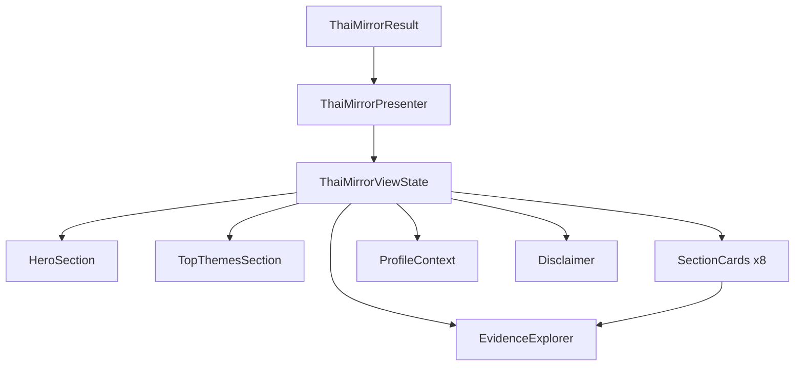

# Thai Mirror UI Specification V1

> **Evolution note (June 2026):** This UI spec describes an early *analyst-style*
> result page (top themes + the nine fusion sections + evidence explorer). The
> **shipped consumer UI** is `ThaiMirrorResultPage` with the Consumer Report
> information architecture (hero, strengths, cautions, advice, life dashboard,
> **Life Timeline**, signature insight, narrative, closing). The analyst widgets
> described here still exist in the repo but are **not** mounted on the consumer
> page. For the current shipped presentation layer and widget inventory, read
> [`EXECUTIVE_SUMMARY.md`](EXECUTIVE_SUMMARY.md).

**Status:** Specification complete — no Flutter implementation  
**Date:** 2026-06-08  
**Input contract:** `ThaiMirrorResult` v1  
**Target:** Mobile-first Result Page (self-understanding, not fortune-telling)

---

## Executive Summary

This document defines the **Thai Mirror Result Page** — how `ThaiMirrorResult` maps to a readable, KnowMe-branded mobile experience. It is a **presentation specification only**. No widgets, screens, or domain changes.

**Positioning:** *กระจกสะท้อนตัวตน* — reflective mirror, not *ดูดวง*.

---

## 1. Page Architecture

### Layer model

```
ThaiMirrorResult (domain — frozen)
        ↓
ThaiMirrorViewModel (future — maps domain → view state)
        ↓
ThaiMirrorResultPage (future — scrollable screen)
        ↓
Section widgets (future — pure presentation)
```

### Page identity

| Field | Value |
|-------|-------|
| Page name (EN) | Thai Mirror |
| Page name (TH) | กระจกไทย / กระจกสะท้อนตัวตน |
| Route (proposed) | `/thai/mirror` or `/results/thai-mirror` |
| Entry (future) | Home → Thai Astrology card, post-birth-input flow |
| Primary locale | Thai (`titleTh`, narrative summaries) |
| Secondary locale | English (`title`, `ThemeDefinition.name`) |

### Visual tone (KnowMe, not horoscope site)

| Do | Don't |
|----|-------|
| Calm neutrals, generous whitespace | Gold/purple mystic gradients |
| Card-based sections, soft corners | Zodiac wheel hero backgrounds |
| Reflective copy ("อาจ", "หลายครั้ง") | Predictive headlines ("ชะตาของคุณ") |
| Evidence as optional transparency | Fortune-teller authority framing |
| System fonts / existing KnowMe theme | Decorative Thai script overload |

Align visually with **Fusion Result Page** patterns: section headings, muted disclosure text, card snapshots — but scoped to Thai lens only.

### Page states

| State | Condition | UI behaviour |
|-------|-----------|--------------|
| Loading | Pipeline in progress | Skeleton cards, no partial domain mutation |
| Ready (structural) | `narrativeStatus: structuralOnly` | Show themes + evidence; summary placeholders |
| Ready (complete) | `narrativeStatus: complete` | Full narrative summaries |
| Partial | `narrativeStatus: partial` | Show summaries where present; badge on incomplete sections |
| Degraded | `profileContext.hasWarnings` | Profile Context banner visible |
| Empty | All sections empty | Guided empty state (see §6) |

---

## 2. Section Hierarchy

### Scroll order (mobile)

```
┌─────────────────────────────────────┐
│ 1. Hero Section                     │  sticky optional: page title only
├─────────────────────────────────────┤
│ 2. Top Themes (detailed cards)      │  high scan priority
├─────────────────────────────────────┤
│ 3. Core Self                        │  fusion section cards
│ 4. Thinking Style                   │  collapsed by default after #3
│ 5. Emotional World                  │
│ 6. Relationships                    │
│ 7. Work & Ambition                  │
│ 8. Strengths                        │
│ 9. Growth Areas                     │
│ 10. Growth Path                     │
├─────────────────────────────────────┤
│ 11. Evidence Explorer               │  collapsed by default
├─────────────────────────────────────┤
│ 12. Profile Context                 │  collapsed if no warnings
├─────────────────────────────────────┤
│ 13. Disclaimer                      │  always visible at bottom
└─────────────────────────────────────┘
```

### Priority tiers

| Tier | Blocks | Rationale |
|------|--------|-----------|
| P0 — Above fold | Hero, Top Themes (chips + first card) | Immediate self-recognition |
| P1 — Primary reading | Core Self, Thinking Style, Emotional World | Core mirror narrative |
| P2 — Context | Relationships, Work & Ambition, Strengths | Life-domain detail |
| P3 — Growth | Growth Areas, Growth Path | Soft developmental framing |
| P4 — Transparency | Evidence Explorer, Profile Context, Disclaimer | Trust + audit |

### Navigation affordances (future)

- **Section jump menu** — floating action or top chips: `แก่นตัวตน | อารมณ์ | ความสัมพันธ์ | …`
- **Deep link anchor** — `#core_self`, `#evidence` for share/revisit
- **Back** — returns to birth input or Home (not Fusion unless user navigates)

---

## 3. Data Mapping

### Root: `ThaiMirrorResult`

| UI block | Domain fields |
|----------|---------------|
| Hero title | Static copy + optional `generatedAt` |
| Hero top theme chips | `topThemes` (max 3) |
| Hero reflection summary | Derived — see below |
| Section cards (×8) | `sections[]` matched by `ThaiMirrorSectionId` |
| Evidence Explorer | Aggregated from all `sections[].evidence` |
| Profile Context | `profileContext` |
| Disclaimer | `disclaimers` |
| Version badge (dev) | `contractVersion`, `narrativeStatus` |

### Hero Reflection Summary (derived, not in domain)

Compose at view-model layer — **do not add to domain**:

```
IF narrativeStatus == complete AND coreSelf.summary != null:
  → First 1–2 sentences of coreSelf.summary (max ~120 chars)
ELSE IF topThemes.isNotEmpty:
  → Template: "ธีมเด่นของคุณอาจเน้นที่ {topThemes[0].themeName} …"
ELSE:
  → Fallback: "กระจกนี้สะท้อนแพทเทิร์นจากข้อมูลเกิดของคุณ"
```

### Per-section: `ThaiMirrorSection`

| UI element | Domain field |
|------------|--------------|
| Section title | `titleTh` (primary), `title` (subtitle EN, optional) |
| Narrative body | `summary` |
| Theme list | `supportingThemes` |
| Evidence count badge | `evidence.length` |
| Traceability footnote | `narrativeMetadata` where `sectionId` matches |

### Per-theme: `ThaiMirrorThemeRef`

| UI element | Domain field | Display rule |
|------------|--------------|--------------|
| Theme name | `themeName` | Primary label |
| Description | `description` | 1–2 lines, muted |
| Confidence | `confidence` | Badge — see Top Themes spec |
| Score | `score` | **Hidden from user** — internal ranking only |
| Theme id | `themeId` | Evidence Explorer only |

### Per-evidence: `ThaiMirrorEvidence`

| UI element | Domain field |
|------------|--------------|
| Lens label | `lensSource.labelTh` |
| Content title | `contentTitle` ?? resolved via `ThaiContentRegistry` |
| Content key | `contentKey` — monospace in expanded dev mode |
| Contribution | `contribution` — optional bar, hidden in V1 consumer UI |
| Linked themes | `supportedThemeIds` |

### Profile Context: `ThaiMirrorProfileContext`

| UI element | Domain field |
|------------|--------------|
| Birth time status | `hasBirthTime` |
| Calculation version | `calculationStandardVersion` |
| Warnings list | `warnings[].code`, `warnings[].message`, `warnings[].severity` |
| Lens coverage | `lagnaKey`, `lagnaLordKey`, `myanmarKeyCount`, `mahabhutaKeyCount` |

---

## 4. Block Specifications

### Block 1 — Hero Section

| Attribute | Spec |
|-----------|------|
| **UI Purpose** | Orient user: this is a *mirror*, show top identity signals immediately |
| **Data Source** | `topThemes`, `sections[coreSelf].summary`, `narrativeStatus` |
| **Priority** | P0 |
| **Layout** | Vertical stack, 16–24px padding |

**Content:**

| Element | Mapping |
|---------|---------|
| Title | `กระจกสะท้อนตัวตน` (TH) / `Your Thai Mirror` (EN) |
| Subtitle | `จากโหราศาสตร์ไทย · Self-understanding` |
| Top theme chips (×3) | `topThemes[i].themeName` — pill badges, rank order preserved |
| Reflection summary | Derived (§3) — max 2 lines, 15–17sp body |

**Empty state:** No chips; summary = "ยังไม่มีธีมเด่นเพียงพอ — ลองตรวจสอบข้อมูลเกิด"  
**Future:** Birth date display from profile snapshot; share button

---

### Block 2 — Top Themes (detailed)

| Attribute | Spec |
|-----------|------|
| **UI Purpose** | Expand hero chips into scannable theme cards |
| **Data Source** | `topThemes` |
| **Priority** | P0 |
| **Count** | **Exactly 3** (matches `ThaiMirrorAssembler.topThemeLimit`) — show fewer if <3 |

**Per theme card:**

| Field | Show? | Format |
|-------|-------|--------|
| Rank | Yes | `#1` `#2` `#3` subtle, not gamified |
| Theme Name | Yes | `themeName` — 16sp semibold |
| Description | Yes | `description` — 14sp muted |
| Confidence | Yes | Badge: `สูง` / `ปานกลาง` / `ต่ำ` from `ThaiThemeConfidenceLevel` |
| Evidence Count | Yes | `N แหล่งอ้างอิง` — count evidence rows across all sections where `supportedThemeIds` contains `themeId` |
| Score | **No** | Never show raw score to user |

**Badge style:**

| Confidence | Badge |
|------------|-------|
| `high` | Filled soft green/neutral — `ความชัดเจนสูง` |
| `medium` | Outlined — `ปานกลาง` |
| `low` | Outlined muted — `บางส่วน` |

**Card layout:** Horizontal rank + vertical text; no icon per zodiac.  
**Empty state:** Hide block entirely if `topThemes.isEmpty`.  
**Future:** Tap card → scroll to Evidence Explorer filtered by theme

---

### Blocks 3–10 — Fusion Section Cards

Shared template for: Core Self, Thinking Style, Emotional World, Relationships, Work & Ambition, Strengths, Growth Areas, Growth Path.

| Attribute | Spec |
|-----------|------|
| **UI Purpose** | Domain-specific self-understanding narrative |
| **Data Source** | `sections` where `id` matches `ThaiMirrorSectionId` |
| **Priority** | P1–P3 (see hierarchy) |
| **Default state** | **Expanded:** Core Self, Thinking Style, Emotional World |
| | **Collapsed:** Relationships, Work, Strengths, Growth Areas, Growth Path |

**Card anatomy:**

```
┌──────────────────────────────────────┐
│ [icon] แก่นตัวตน          [chevron] │  ← titleTh + expand toggle
├──────────────────────────────────────┤
│ {summary paragraph}                  │  ← summary (narrative)
├──────────────────────────────────────┤
│ Supporting themes (chips, max 5)     │  ← supportingThemes
├──────────────────────────────────────┤
│ 📎 3 แหล่งอ้างอิง  [ดูหลักฐาน →]     │  ← evidence.length + link
└──────────────────────────────────────┘
```

| Section | Title TH | Special layout |
|---------|----------|----------------|
| Core Self | แก่นตัวตน | Standard paragraph |
| Thinking Style | รูปแบบการคิด | Standard paragraph |
| Emotional World | โลกอารมณ์ | Standard paragraph |
| Relationships | ความสัมพันธ์ | Standard paragraph |
| Work & Ambition | งานและความทะเยอทะยาน | Standard paragraph |
| Strengths | จุดแข็ง | Allow bullet rendering if summary contains `•` |
| Growth Areas | พื้นที่เติบโต | Softer card tint; no red/warning icons |
| Growth Path | เส้นทางเติบโต | Optional subtle forward-arrow motif |

**Section-specific data mapping:**

| UI field | Source |
|----------|--------|
| Title | `section.titleTh` |
| Body | `section.summary` |
| Theme chips | `section.supportingThemes[].themeName` (top 5) |
| Evidence link | `section.evidence` → Evidence Explorer scoped to section |

**Empty state (per section):**

| Condition | Copy (TH) |
|-----------|-----------|
| `summary` present, no themes | Show summary only |
| No summary, no themes | `ยังไม่มีข้อมูลเพียงพอในส่วนนี้` + muted explanation |
| `narrativeStatus == structuralOnly` | Show theme chips + "กำลังเตรียมคำอธิบาย…" OR run narrative before page |

**Future expansion:** Section-level Fusion compare badge; audio read-aloud

---

### Block 11 — Evidence Explorer

| Attribute | Spec |
|-----------|------|
| **UI Purpose** | Transparency — show *why* themes appear, not mysticism |
| **Data Source** | All `sections[].evidence`, `ThaiContentRegistry`, `topThemes` |
| **Priority** | P4 |
| **Default** | **Collapsed** — header visible, body hidden |

#### Collapsed state

```
┌──────────────────────────────────────┐
│ 🔍 สำรวจหลักฐาน            [expand] │
│ ดูว่าธีมมาจากลัคนา เลข 7 ตัว มหาภูติ │
│ {totalEvidence} รายการ · {lensCount} เลนส์ │
└──────────────────────────────────────┘
```

#### Expanded state — flow

```
Theme (selectable chip row — all unique themeIds)
    ↓
Evidence list (filtered by selected theme OR all)
    ↓
Content source detail (on tap)
```

**Level 1 — Lens filter tabs (optional):**

| Tab | Filter |
|-----|--------|
| ทั้งหมด | All evidence |
| ลัคนา | `lensSource == lagna` |
| เจ้าเรือน | `lagnaLord` |
| เลข 7 ตัว | `myanmarSeven` |
| มหาภูติ | `mahabhutaPosition` |

**Level 2 — Evidence row (collapsed):**

| Field | Display |
|-------|---------|
| Lens badge | `lensSource.labelTh` — colour-coded per lens |
| Content title | `contentTitle` |
| Linked themes | `supportedThemeIds` as small chips |

**Level 3 — Evidence row (expanded on tap):**

| Field | Display |
|-------|---------|
| Content key | `contentKey` — dev mode or "แหล่งอ้างอิง" label |
| Content summary | First sentence from `ThaiContentRegistry.resolve(key).summary` |
| Contribution | Hidden in consumer V1 |
| Section context | Which section(s) reference this key |

**Colour coding (lens badges):**

| Lens | Suggested token |
|------|-----------------|
| Lagna | KnowMe primary muted |
| Lagna Lord | Secondary |
| Myanmar Seven | Tertiary |
| Mahabhuta Position | Quaternary |

**Empty state:** `ยังไม่มีหลักฐานที่เชื่อมโยง — ตรวจสอบข้อมูลเกิด`  
**Future:** Link to Content Library article; Fusion cross-reference

---

### Block 12 — Profile Context

| Attribute | Spec |
|-----------|------|
| **UI Purpose** | Audit transparency — birth data quality, warnings |
| **Data Source** | `profileContext` |
| **Priority** | P4 |
| **Default** | Expanded if `hasWarnings`; else collapsed |

**Fields:**

| Condition | UI |
|-----------|-----|
| `!hasBirthTime` | Banner: `ไม่มีเวลาเกิด — ลัคนาอาจไม่แสดง` |
| `warnings.isNotEmpty` | List each `ProfileWarning.message` with severity icon |
| Always | Footer line: `มาตรฐานการคำนวณ: v{calculationStandardVersion}` |
| Optional detail | `myanmarKeyCount` / `mahabhutaKeyCount` as "เลนส์ที่ใช้: …" |

**Severity mapping:**

| `ProfileWarningSeverity` | Icon |
|--------------------------|------|
| `high` | Amber info |
| `medium` | Neutral info |
| `low` | Muted text only |

**Future:** Edit birth data CTA; link to lunar dataset coverage status

---

### Block 13 — Disclaimer

| Attribute | Spec |
|-----------|------|
| **UI Purpose** | Legal/ethical framing — reflective tool, not prediction |
| **Data Source** | `disclaimers` (+ `ThaiMirrorContract.defaultDisclaimersTh` for TH locale) |
| **Priority** | Always visible |
| **Layout** | Muted 12–13sp, bottom padding 32px+ safe area |

**Copy source priority:**

1. `result.disclaimers` (EN default from contract)
2. Locale map to `defaultDisclaimersTh` when `locale == th`

**Visual:** No border card — plain text with info icon. Same pattern as Fusion disclosure.

---

## 5. Top Themes Spec (summary)

| Rule | Value |
|------|-------|
| Count | **3** max (`topThemes.length ≤ 3`) |
| Badge shape | Rounded pill, horizontal in Hero; full card in Block 2 |
| Confidence | **Show** — human label, not raw enum |
| Evidence count | **Show** — aggregated cross-section count |
| Raw score | **Never show** |
| Sort order | Preserve domain order (score desc) |

---

## 6. Empty States

### Page-level empty

| Scenario | UI |
|----------|-----|
| No themes at all | Illustration + "ยังไม่สามารถสร้างกระจกได้" + CTA กรอกข้อมูลเกิด |
| Pipeline error | Error card + retry |

### Section-level empty

| Scenario | UI |
|----------|-----|
| No themes in section | Collapsed card with one-line empty copy |
| Structural only | Theme chips visible; summary placeholder |
| Missing lagna | Profile Context banner explains limitation |

### Evidence Explorer empty

| Scenario | UI |
|----------|-----|
| No evidence rows | "ยังไม่มีหลักฐาน" inside collapsed explorer |

---

## 7. Mobile UX Flow

### Reading flow (happy path)

```
Open page
  → Scan Hero chips (3 sec)
  → Read Hero reflection (10 sec)
  → Skim Top Theme cards (15 sec)
  → Expand Core Self → read summary
  → Scroll Emotional World + Relationships
  → Optional: expand Evidence Explorer
  → Glance Disclaimer
```

### Interaction patterns

| Pattern | Usage |
|---------|-------|
| **Vertical scroll** | Primary navigation — single column |
| **Expand/collapse** | Section cards P2+; Evidence Explorer |
| **Horizontal chips** | Hero top themes; theme filters in Explorer |
| **Tap theme chip** | Filter Evidence Explorer |
| **Pull to refresh** | Re-run pipeline (future — requires birth data) |
| **Haptic** | Optional on expand — subtle |

### Card layout tokens (proposed)

| Token | Value |
|-------|-------|
| Page horizontal padding | 16px |
| Card margin bottom | 12px |
| Card corner radius | 12px (match Fusion) |
| Section title | 18sp semibold |
| Body text | 15sp regular, 1.5 line height |
| Muted text | 13sp, 60% opacity |

### Accessibility

- Section headers are `Semantics` headers
- Confidence badges have text labels (not colour-only)
- Evidence lens tabs are keyboard/screen-reader navigable
- Minimum tap target 44×44

### Tablet / desktop (V2)

- Two-column: Hero + Top Themes left; sections right
- Evidence Explorer as side panel

---

## 8. Future Compatibility

### Fusion V1 integration points

| Integration | Where on page | Data |
|-------------|---------------|------|
| "Compare with Fusion" CTA | Hero footer or app bar | `ThaiMirrorResult` → future `ThaiMirrorFusionAdapter` |
| Shared theme ids | Top Themes + sections | `themeId` maps to `ThemeCatalogV1` / `FusionThemeIds` |
| Lens snapshot card | Below Hero | Same card pattern as `FusionResultPage` lens snapshots |
| Cross-lens tension | Not on Thai-only page | Fusion page consumes Thai signals separately |

**Do not embed Fusion engine on this page in V1.**

### Firestore snapshot (proposed schema)

```json
{
  "mirror_contract_version": "v1",
  "narrative_status": "complete",
  "generated_at": "ISO-8601",
  "top_themes": ["disciplined", "builder", "leadership"],
  "sections": {
    "core_self": { "summary": "...", "theme_ids": [], "evidence_keys": [] }
  },
  "profile_context": { "has_birth_time": true, "warnings": [] }
}
```

**UI impact:** Page can hydrate from snapshot without re-running pipeline; show `generatedAt` in Profile Context.

### Recommendation Engine (future)

| Hook | Usage |
|------|-------|
| `topThemes[0].themeId` | Primary recommendation seed |
| `growthPath` section summary | Growth content suggestions |
| `growthAreas` themes | Soft nudge topics — never punitive |

### Thai Astrology product expansion

| Future feature | UI placeholder |
|----------------|----------------|
| Lunar date detail | Profile Context row |
| Seven-number chart visual | New tab — not on Mirror V1 page |
| Re-run with corrected birth time | Profile Context CTA |

---

## 9. Migration Impact

| Area | Impact |
|------|--------|
| Domain layer | **None** — read-only consumption of `ThaiMirrorResult` |
| Existing routes | **None** until page registered |
| Fusion | **None** — parallel page |
| Home | Future nav item only |
| Users | No change until page shipped |

---

## 10. Blast Radius

| Component | Risk |
|-----------|------|
| `ThaiMirrorResult` models | None — no changes |
| Assembler / Narrative | None |
| Theme / Foundation | None |
| New UI layer only | Isolated under `lib/features/astrology/thai/mirror/presentation/` |

---

## 11. Files To Create (future implementation)

```
lib/features/astrology/thai/mirror/
  presentation/
    thai_mirror_result_page.dart          # Screen
    thai_mirror_view_model.dart           # Maps ThaiMirrorResult → view state
    widgets/
      thai_mirror_hero_section.dart
      thai_mirror_top_themes_section.dart
      thai_mirror_section_card.dart
      thai_mirror_evidence_explorer.dart
      thai_mirror_profile_context_banner.dart
      thai_mirror_disclaimer_footer.dart
      thai_mirror_theme_chip.dart
      thai_mirror_confidence_badge.dart
  routing/
    thai_mirror_routes.dart

test/
  thai_mirror_view_model_test.dart
  thai_mirror_result_page_test.dart       # widget tests
```

**Optional presenter (recommended):**

```
lib/features/astrology/thai/mirror/
  presentation/
    thai_mirror_view_state.dart           # Immutable UI DTOs
    thai_mirror_presenter.dart            # ThaiMirrorResult → view state
```

Keeps widgets free of domain logic — mirrors Theme Presenter pattern.

---

## 12. Files To Avoid Modifying

| Path | Reason |
|------|--------|
| `lib/features/astrology/thai/foundation/**` | Frozen V1.1 |
| `lib/features/astrology/thai/theme/**` | Frozen theme pipeline |
| `lib/features/astrology/thai/content/**` | Content library complete |
| `lib/features/astrology/thai/mirror/thai_mirror_assembler.dart` | Domain |
| `lib/features/astrology/thai/mirror/thai_mirror_narrative_generator.dart` | Domain |
| `lib/features/astrology/thai/mirror/models/**` | Contract — extend only via new view-state types |
| `lib/features/tests/fusion/**` | Fusion V1 locked |
| MBTI / EQ / Western / BaZi | Out of scope |

---

## 13. Recommendation

### Implementation order

| Phase | Deliverable |
|-------|-------------|
| **UI-V1a** | `ThaiMirrorPresenter` + `ThaiMirrorViewState` + unit tests |
| **UI-V1b** | `ThaiMirrorResultPage` skeleton — Hero + Top Themes + 1 section card |
| **UI-V1c** | All 8 section cards + expand/collapse |
| **UI-V1d** | Evidence Explorer + Profile Context + Disclaimer |
| **UI-V1e** | Route registration + Home entry (behind feature flag) |
| **UI-V2** | Firestore hydrate + Fusion CTA |

### Key decisions for implementers

1. **Run narrative before page** — always pass `narrativeStatus: complete` to UI; avoid showing structural-only to end users.
2. **Never surface `score`** — use rank order and confidence only.
3. **Thai-first copy** — `titleTh` and narrative summaries; EN as secondary.
4. **Evidence is opt-in depth** — default collapsed; power users expand.
5. **Reuse Fusion card/heading styles** — visual consistency across KnowMe results.
6. **Feature flag** — `thai_mirror_ui_enabled` until golden-case QA on real birth data.

### View-model pipeline (proposed)

```dart
ThaiAstrologyProfile profile
  → ThaiMirrorAssemblerSpec.inputFromProfile(profile)
  → ThaiMirrorAssembler.assemble(input)
  → ThaiMirrorNarrativeGenerator.generate(structural)
  → ThaiMirrorPresenter.present(complete)
  → ThaiMirrorResultPage(viewState)
```

---

## Appendix A — View State DTO (proposed)

```dart
ThaiMirrorViewState {
  hero: ThaiMirrorHeroState
  topThemes: List<ThaiMirrorThemeCardState>   // max 3
  sections: List<ThaiMirrorSectionCardState>  // 8 fixed order
  evidenceExplorer: ThaiMirrorEvidenceExplorerState
  profileContext: ThaiMirrorProfileBannerState
  disclaimers: List<String>
  narrativeStatus: ThaiMirrorNarrativeStatus
}

ThaiMirrorThemeCardState {
  rank: int
  themeName: String
  description: String?
  confidenceLabel: String
  evidenceCount: int
}

ThaiMirrorSectionCardState {
  id: ThaiMirrorSectionId
  titleTh: String
  summary: String?
  themeChips: List<String>
  evidenceCount: int
  isExpandedDefault: bool
}

ThaiMirrorEvidenceExplorerState {
  totalCount: int
  lensCounts: Map<ThaiMirrorLensSource, int>
  rows: List<ThaiMirrorEvidenceRowState>
  filterByThemeId: String?
}
```

---

## Appendix B — Mermaid: Page data flow



---

## Definition of Done (Specification)

- [x] Page architecture documented
- [x] 13 UI blocks specified with data mapping
- [x] Top Themes rules (3, confidence, evidence count)
- [x] Evidence Explorer collapsed/expanded flow
- [x] Mobile scroll order and interaction patterns
- [x] Empty states defined
- [x] Fusion / Firestore / Recommendation hooks documented
- [x] Migration impact + blast radius
- [x] Future file list + avoid list
- [x] No Flutter code written
- [x] No domain layer changes required
